# U-Live 短视频平台前后端开发

### 项目简介


​		**U-Live APP**是一个专供于大学生生活方向的短视频社交平台，主要功能包括短视频发布、视频列表浏览、点赞、设置视频隐私、搜索、分享等。用户可以在平台上发布自己的短视频，并通过推荐和好友视频列表来浏览其他用户的视频。同时，用户可以对喜欢的视频进行点赞，也可以设置自己的视频为公开或私密。此外，客户端还提供搜索功能，用户可以通过关键词找到对应的视频，并可以通过生成二维码来分享视频。除了<u>**短视频模块**</u>外，系统还有<u>**评论模块**</u>，用户可以在视频下发表评论信息，对评论进行点赞或取消赞，并可以删除自己的评论。另外，系统还有<u>**社交模块**</u>，用户可以关注、取关或互相关注其他用户，显示好友的视频，以及查看关注和粉丝列表。<u>**用户模块**</u>包括注册账号、登录账号、退出账户、密码登录、修改图片展示和个人信息等功能。最后，系统还提供<u>**消息模块**</u>，用于交互信息反馈，当有评论或关注信息时会进行提醒。

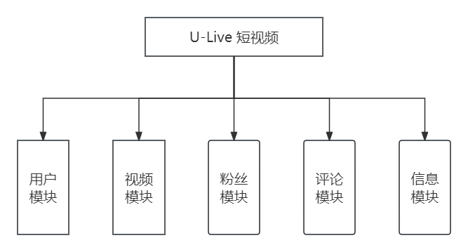

| 序号 | 子系统归属  | 子功能模块     | 描述                           |
| ---- | ----------- | -------------- | ------------------------------ |
| 1    | 短视频 模块 | 视频发布       | 用户能够发布视频               |
| 2    | 短视频 模块 | 视频列表       | 实现多视频浏览，分为推荐，好友 |
| 3    | 短视频 模块 | 点赞           | 简单的点赞和取消赞             |
| 4    | 短视频 模块 | 设置视频隐私   | 设置为公开/私密                |
| 5    | 短视频 模块 | 搜索           | 提供搜索框，获取对应视频       |
| 6    | 短视频 模块 | 分享           | 生成对应视频的二维码           |
| 7    | 评论 模块   | 发表评论       | 允许在视频下发布评论信息       |
| 8    | 评论 模块   | 点赞评论       | 可对评论进行点赞或取消赞       |
| 9    | 评论 模块   | 删除评论       | 由用户长按评论做到自删选项弹出 |
| 10   | 评论 模块   | 显示评论       | 评论内容及评论数的显示         |
| 11   | 社交 模块   | 关注/取关/互关 | 对其他用户的关注方式           |
| 12   | 社交 模块   | 显示内容       | 显示好友的视频                 |
| 13   | 社交 模块   | 关注和粉丝列表 | 个人的粉丝及关注用户的统计     |
| 14   | 社交 模块   | 用户面板计数   | 面板统计数的展示               |
| 15   | 用户 模块   | 注册账号       | 采用阿里云短信服务进行鉴权     |
| 16   | 用户 模块   | 登录账号       | 使用手机验证码登录，同上       |
| 17   | 用户 模块   | 退出账户       | 登出该账号                     |
| 18   | 用户 模块   | 密码登录       | 使用密码进行登录               |
| 19   | 用户 模块   | 修改图片展示   | 可上传背景图和头像             |
| 20   | 用户 模块   | 修改个人信息   | 允许修改个人相关信息           |
| 21   | 消息 模块   | 交互信息反馈   | 评论及关注信息会被提醒         |

<br>

### 技术选型

​		客户端采用uni-app框架进行构建，由于uni-app是采用Vue.js这类单页面编写思想，因此也能够使用到Vue的组件以及SCSS直接写入样式。后端以Java Web开发框架SpringBoot为基础，构建业务逻辑与数据库交互，还有与各类中间件的API调用。使用Nginx构建负载均衡的API接口，形成能够承受高并发集群。在数据库层面上，采用MySQL这类关系型数据库，从而能够更好地承受业务生产的数据。

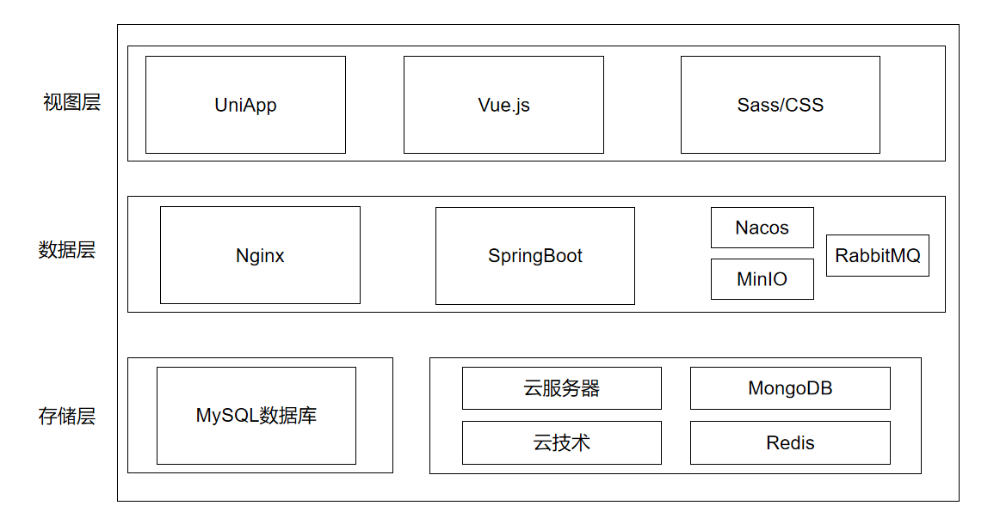

<br>

### 环境介绍

#### **开发工具**

| 工具名称            | 版本号    |
| ------------------- | --------- |
| IntelliJ IDEA       | 2021.3.3  |
| Navicat Premium     | 15        |
| RedisDesktopManager | 0.8.8.384 |
| Xshell              | 7         |
| Xftp                | 7         |
| HBuilder X          | 3.8.12    |

<br>

#### **开发组件**

| 组件名称      | 版本号    |
| ------------- | --------- |
| JDK           | 1.8.0_201 |
| MySQL         | 8.0.28    |
| Redis         | 6.2.1     |
| MongoDB       | 4.2.8     |
| SpringBoot    | 2.5.11    |
| Maven         | 3.8.6     |
| Knife4j       | 2.0.9     |
| MinIO         | 8.2.1     |
| RabbitMQ      | 3.8.5     |
| Nacos         | 2.0.2     |
| Nginx         | 1.20.2    |
| uni-app       | /         |
| uni-Cloud     | /         |
| 阿里云短信SDK | 2.0.24    |

<br>

#### **开发环境**

​		所有的前后端代码均在Windows 10系统中编写；后端的API接口打包为Jar包发布在阿里云服务器上，服务器采用CentOS 7.6系统。后续测试、前后端联调以及接口自测，可以用雷电模拟器（安卓模拟器），以及自己的手机。[u-live.sql](https://github.com/QiPanTanYi/U-Live/blob/main/u-live.sql)为MySQL建表SQL脚本，最好是直接在Navicat中使用；[MyLive-Dev](https://github.com/QiPanTanYi/U-Live/tree/main/MyLive-Dev)为前端uni-app项目，必须配合HBuilder X 使用，其中[App.vue](https://github.com/QiPanTanYi/U-Live/blob/main/MyLive-Dev/App.vue)中的serverUrl需要修改为服务器的外网IP地址；[U-Live-dev](https://github.com/QiPanTanYi/U-Live/tree/main/U-Live-dev)为后端SpringBoot项目，建议使用IDEA浏览该部分，其中[book-api](https://github.com/QiPanTanYi/U-Live/tree/main/U-Live-dev/book-api/src/main/resources)下的几个配置yml文件内容需要手动修改为配置好的服务器地址以及对应中间件的映射内网+端口，在打包后端项目后，book-api中target下的U-Live.jar即为部署到服务器的后端Jar包。

<br>

#### 业务表说明

​		根据功能模块划分，共设计五张表结构，分别为用户信息表（users）、短视频业务表（vlog）、粉丝表（fans）、评论表（comment）、个人关注表（my_liked_vlog）。在设计数据库物理结构时，不采用设置外键的形式进行多表联合，而是使用“弱外键”的数据库交互思想，降低单表或多表的查询压力，但这也同时提出了一定的后端编写能力要求。同样的，后端也需要编写一定的加密手段，确保用户信息传输到数据库的安全性。

===========================================================================

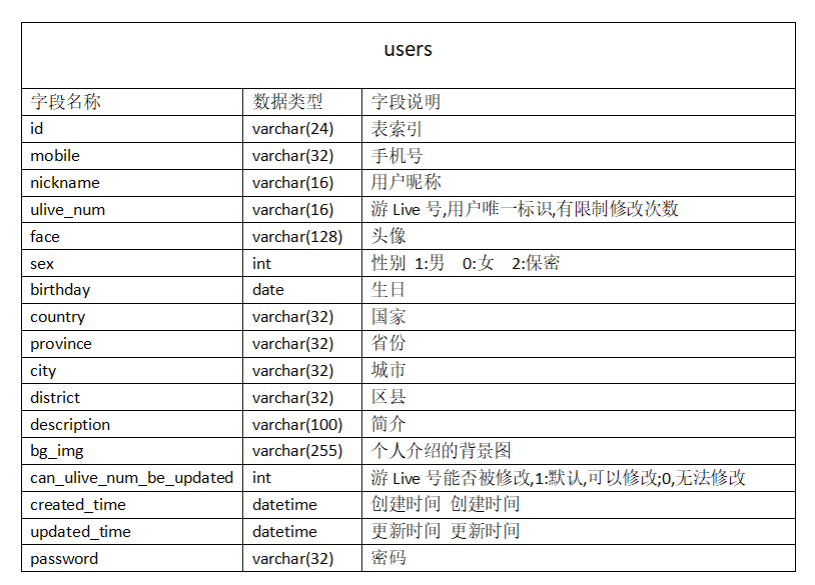

​		在短视频平台的用户管理系统中，“users”表起着至关重要的作用，涵盖用户的基本信息和个人资料。表中的每条记录都以唯一的标识符（id）区分，关联到特定的用户。用户的手机号（mobile）和昵称（nickname）允许平台与用户进行个性化的通信，而“ulive_num”则作为用户在平台上的唯一标识符，便于追踪用户的活动。

​		“face”字段存储用户的头像信息，而性别（sex）、生日（birthday）、国家（country）、省份（province）、城市（city）和地区（district）字段则进一步完善了用户的地理和人口统计信息。用户还可以在描述（description）中自我介绍，而“bg_img”提供了个性化的背景图片设置。

​		此外，表中还包含了用于保护用户隐私和安全的密码（password）字段，以及记录用户资料更新权限的“can_ulive_num_be_updated”字段。每个账户的创建时间（created_time）和最后更新时间（updated_time）则记录了用户资料的时效性。

​		“users”表为平台提供了一个全面的框架，用以存储、管理、并保护用户的个人信息，同时支持用户体验的个性化和社交互动的深化。

===========================================================================

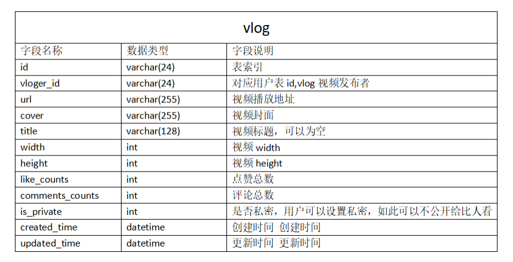

​		数据库中的“vlog”表是用于存储短视频相关信息的关键结构。它负责记录每个视频的详细信息，包括独特的视频标识符、博主ID、视频的URL、封面图像的URL、标题以及视频的尺寸（宽度和高度）。此外，表中也包含了互动性指标，如喜欢的数量和评论的数量，这些数据对于评估视频的受欢迎程度至关重要。表中还记录了视频的隐私设置，以标示视频是公开的还是私有的。每个记录都有创建和更新的时间戳，确保了内容的时效性和历史追踪的可能性。“vlog”表为平台提供了一个全面的视图，以展示和管理视频内容，同时也为内容的推荐和搜索提供了必要的数据支持。

===========================================================================

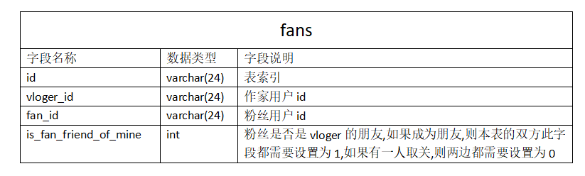

​		“fans”表专门用于维护和管理博主与其粉丝之间的关系。通过独特的标识符将每位博主与粉丝相互对应，进而构建起一个互动的社交网络。在表中，每条记录都包括一个主键ID，确保了记录的唯一性。博主的标识符“vloger_id”与粉丝的标识符“fan_id”分别描绘出了博主与粉丝的连接点。

​		此外，表还引入了一个逻辑字段“is_fan_friend_of_mine”，其值反映了粉丝是否属于博主的个人朋友圈。该字段的二元性质（是朋友为1，非朋友为0）允许平台实现复杂的社交动态查询，通过这些维度为平台提供了一个多层次的社交关系映射，从而支持了更加个性化和社交化的用户体验。

===========================================================================

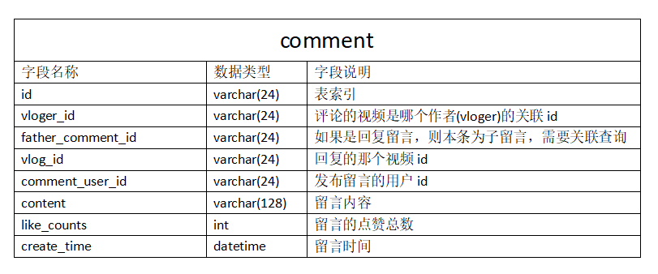

​		在短视频平台的数据模型中，“comment”表显得尤为关键，它被设计来记录用户在各个视频上的互动和社交反馈。此表为每条评论赋予了一个唯一标识符，确保了信息的可追溯性。它关联了特定的博主（vloger_id）和特定的视频（vlog_id），确立了评论与视频内容之间的直接联系。通过“father_comment_id”，该表进一步支持嵌套评论功能，使得用户能够对已有评论进行回复，形成讨论线索。

​		每条记录都包含了发表评论的用户ID（comment_user_id），这为评论提供了明确的归属，同时也允许平台监控和管理用户行为。评论内容（content）字段支持文本输入，为用户间的交流提供了平台。此外，每条评论都有相应的喜欢数（like_counts），这是衡量社交互动的另一个重要指标。最后，创建时间（create_time）的记录不仅为用户提供了时序上的参考，也为内容的时效性分析提供了依据。

​		“comment”表通过这些字段为平台提供了丰富的社交互动数据，使得平台能够捕获用户参与度，增强社区活跃性，并促进内容的动态交流。

===========================================================================

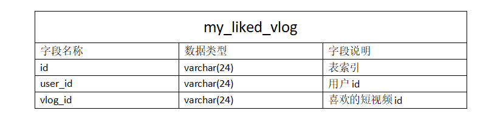

​		在短视频平台的数据架构中，“my_liked_vlog”表扮演着核心角色，旨在跟踪并存储用户对视频内容的偏好。该表通过唯一的记录标识（id）将用户（user_id）与其所喜爱的视频（vlog_id）映射起来，从而形成一种持久的喜好关系记录。每一项记录都是用户表达对特定视频内容喜爱的一个实例，且这种关系是一对一的，即一个用户对一个视频的喜好。此外，这一数据结构也为用户提供了一个直观的方式来回顾他们之前赞赏的内容，增加了平台的互动性和个性化服务的层次。

===========================================================================

<br>

#### 其他工具及中间件的说明

​		前端采用了Flex布局，能够适配大部分移动端的显示尺寸。后端使用Maven聚合工程来构建并管理，采用Knife4j作为后端在线文档（类似PostMan），所有的端口自测可以在这里进行。Knife4j可以在浏览器上输入  已部署项目的服务器IP+端口+/doc.html  中查看，如下图：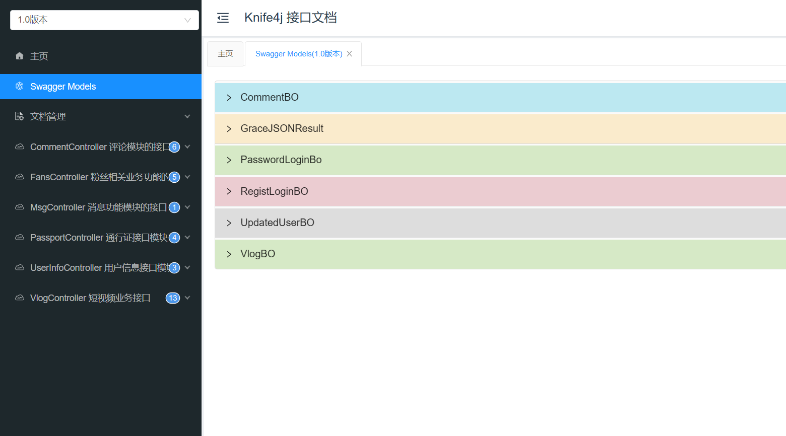

<br>

​		所有视频的存放主要是以DCloud家的[uni-Cloud云存储](https://unicloud.dcloud.net.cn/)为主，上传视频成功后获取对应的CDN地址，并写入到MySQL中。（PS：这部分有免费体验的限额，需要实名认证，但是免费的CDN较少，不太适合后续消耗）

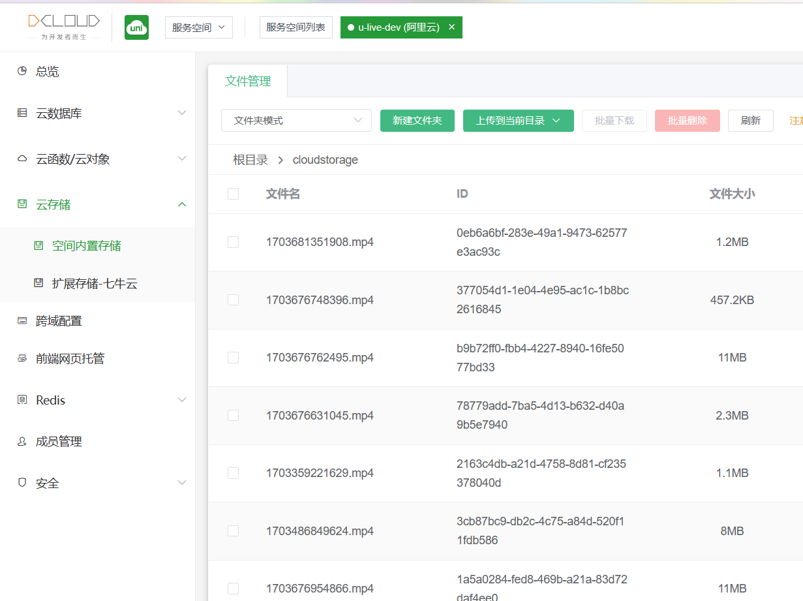

<br>

​		用户的短信登录，前端点击发送验证码后，会进入倒计时60s，后端响应并生成随机六位数，优先存储在Redis中，在60s内无法点击再次发送验证码，这里使用到了Hibernate做了令牌验证。响应成功后会调用到阿里云短信服务，用户手机获取到验证码短信，回归前端输入后即可完成首次注册和登录，该账号即可拥有一系列的默认个人信息（包括密码）。

（PS：[阿里云短信服务](https://dysms.console.aliyun.com/quickstart) 需要实名认证，首次使用会有对应的免费套餐。如果没有企业认证，就必须绑定测试手机号码，也就是说，没有企业认证但已完成个人认证，也只能发送短信到已绑定的手机上，不过这个验证码可以在Redis或者后端日志中查看。在后端中对应的阿里云SMS配置类的参数，需要手动修改）

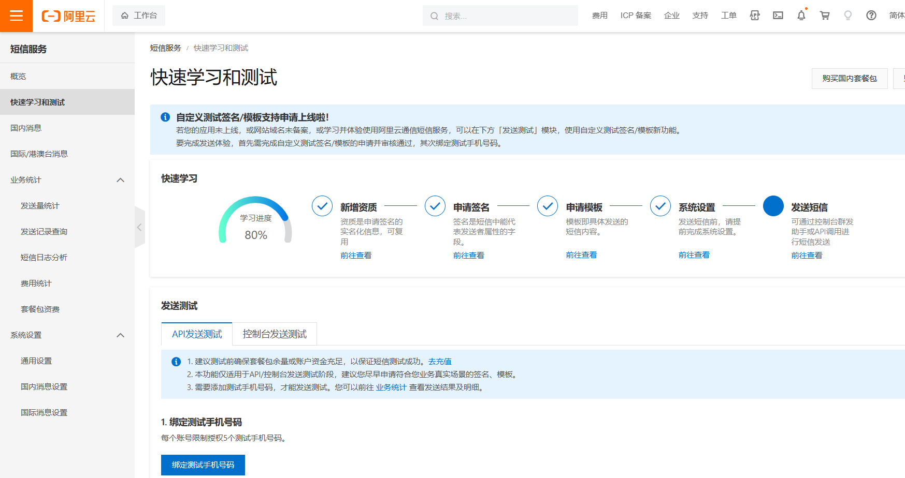

<br>

​		类似头像，背景图这些纯静态文件，最好的方式是存放在其他分布式云存储空间上，首选当然是阿里云的OSS，但是这个东西需要一定的经济投入，而[MinIO](https://www.minio.org.cn/download.shtml#/linux)是大数据开源分布式存储组件之一，加上部署在云服务器上相当简单，非常适合拿来平替OSS。所以该项目中涉及到的用户上传头像及背景图，也是简单粗暴的，直接扔进MinIO后生成对应的地址，存放进MySQL中，需要的时候响应出来即可。（PS:对应的MinIOConfig配置类需要修改参数为服务器外网IP而非内网，避免用户上传后无法显示。MinIO部署完成后，可以在浏览器输入外网IP+9000端口进入它的Web界面，如下图，同时需要将对应的桶表属性由private改为public）

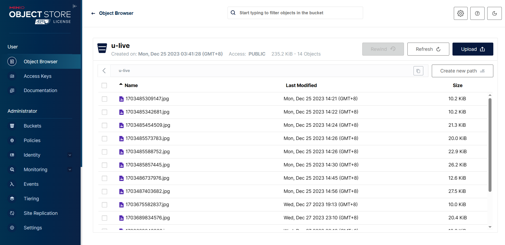

<br>

​		在视频点赞部分，原本是Redis写入点赞数，再存储到MySQL中对应的vlog表中，但为了降低频繁写入存储MySQL的压力，使用了阿里家的[Nacos](https://nacos.io/zh-cn/docs/what-is-nacos.html)注册服务中间件，当点赞数到达10后再统一写入数据库中，否则停留在缓存中间件Redis中不做写入数据库操作。这个组件主要起高并发作用，结合Nginx后，生成集群负载均衡效果，为点赞数部分提供较为合适的优化。（PS：这里采用的是nacos的yaml去配置的，内容如下图 ）

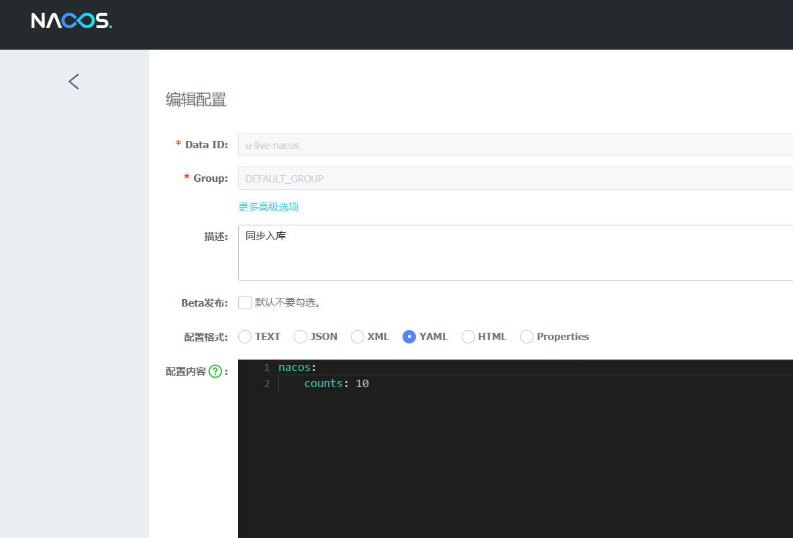

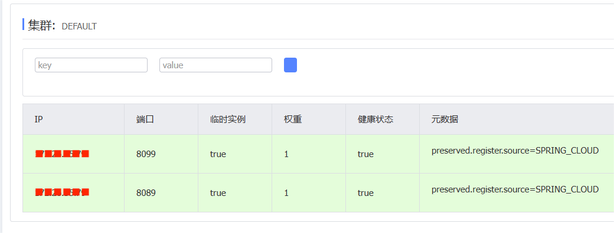

<br>

​		关于消息推送部分，采用了[RabbitMQ](https://www.rabbitmq.com/)+[MongoDB](https://www.mongodb.com/zh-cn)实现，在某视频进行关注博主以及评论操作时，都会发送给该视频博主相应的信息，类似留言效果。这一部分是不依赖主数据库MySQL的。（PS：MongoDB的监控可以用Navicat，RabbitMQ是有对应的Web界面的，为服务器外网IP地址+15672端口）

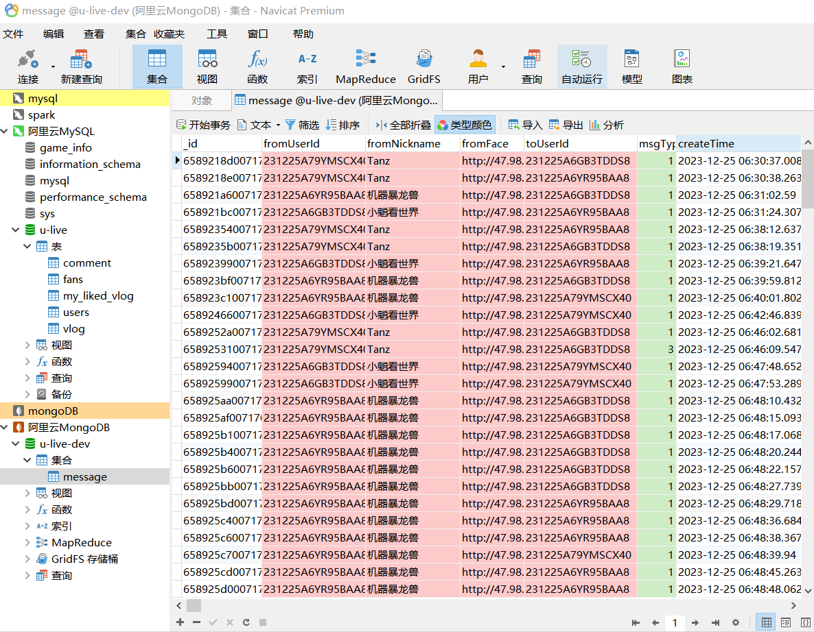

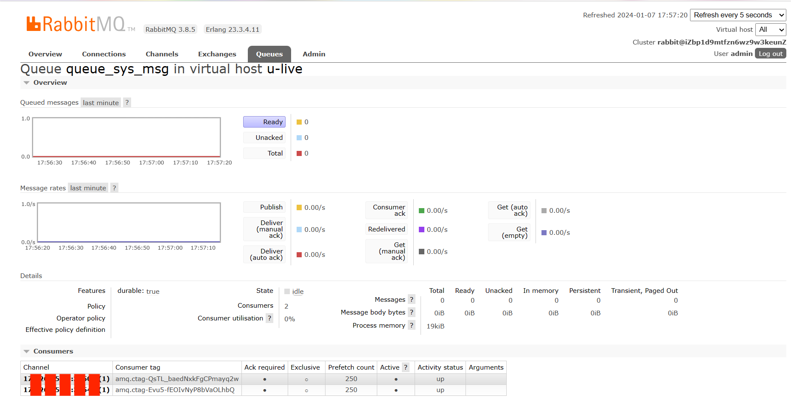

<br>

#### 部署＆启动

```shell
# Nginx 配置
    # 配置上游服务器
   upstream www.bookapi.com {
	server 172.26.XX.XX:8099;
	server 172.26.XX.XX:8089;
   }
    # 配置网关（入口）
    server {
        listen       8000;
        server_name  localhost;

       location / {
           proxy_pass http://www.bookapi.com; 
	}
}
```

```shell
# PS：这些组件都是部署在CentOS 7.6中的，需要逐个启动服务
启动MySQL: /etc/init.d/mysqld start

启动MongoDB: (cd /usr/local/mongoDB) mongod -f mongodb.conf 

启动 RabbitMQ:(rabbitmq-plugins enable rabbitmq_management）
			  service rabbitmq-server start

启动nacos: (cd /usr/local/nacos/bin) sh startup.sh -m standalone

启动Redis: (cd /usr/local/redis/bin） ./redis-server redis.conf

启动MinIO: (cd /usr/local/minio) ./start-minio.sh

启动Jar包-后端: nohup java -jar U-Live.jar >my.log 2>&1 &
			  nohup java -jar U-Live-8089.jar >my-8089.log 2>&1 &

启动Nginx：./sbin/nginx -t   ./sbin/nginx   ./sbin/nginx -s reload
```

<br>

### 项目展示

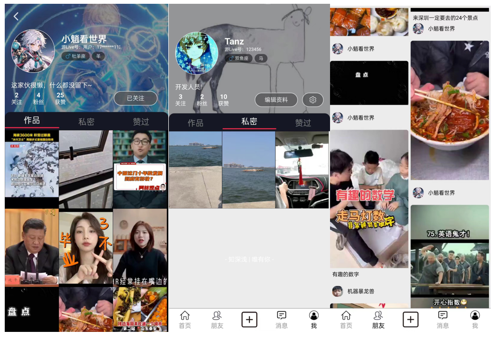

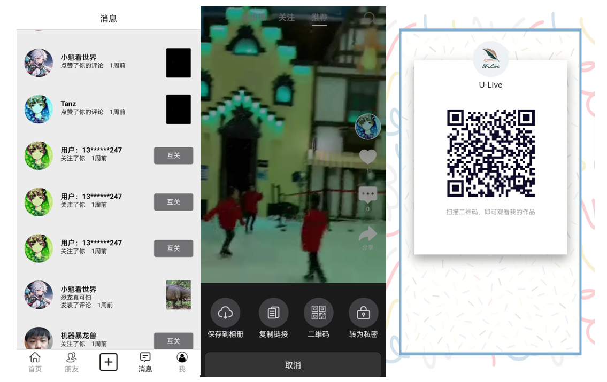

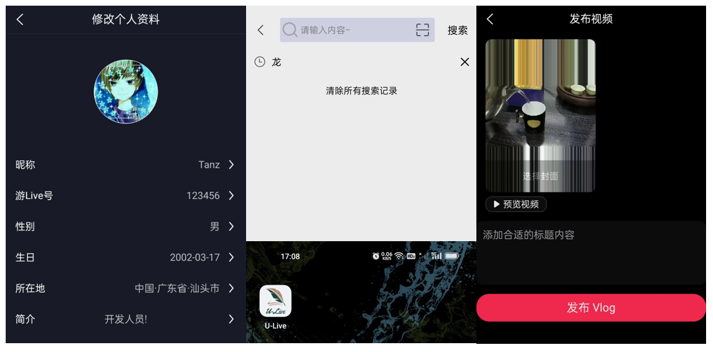


**By: TanZ**  (t1748617439@163.com)

